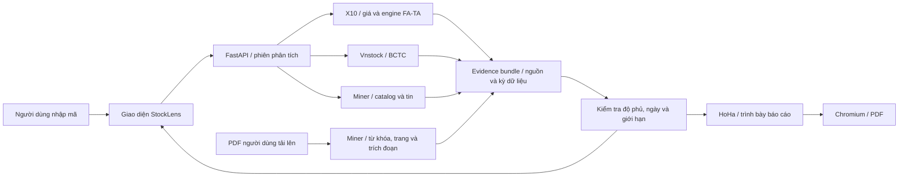

# Báo cáo hệ thống StockLens

**Đề tài:** Xây dựng hệ thống phân tích cơ hội đầu tư cổ phiếu.

**Tên nhóm, thành viên, môn học, giảng viên:** điền theo thông tin nhóm; hệ thống không tự tạo danh tính.

## 1. Bài toán và mục tiêu

Người dùng cần đánh giá một cổ phiếu từ nhiều nguồn và tạo báo cáo theo nhu cầu. Giá và khối lượng cho biết xu hướng; BCTC hỗ trợ đánh giá chất lượng, tăng trưởng và an toàn; tin doanh nghiệp và báo cáo thường niên cung cấp bằng chứng định tính. StockLens nối các nguồn này trong một quy trình duy nhất, ghi rõ dữ liệu còn thiếu và xuất báo cáo PDF.

## 2. Kiến trúc

Tách adapter cho phép thay nguồn dữ liệu và sửa giao diện mà vẫn giữ engine gốc. FastAPI chạy công việc nền để giao diện hiển thị tiến độ. Dữ liệu và PDF tải lên giữ trong bộ nhớ, không cần Telegram token, Supabase hay máy chủ Next.js cho luồng giữa kỳ.

## 3. Quy trình chuẩn hóa và kiểm soát dữ liệu

1. Kiểm tra mã cổ phiếu, lấy tối đa khoảng 850 ngày lịch để đủ đầu vào MA200 và lợi suất 12 tháng.
2. Chuẩn hóa OHLCV, loại dòng giá âm, khối lượng âm, OHLC không nhất quán; giữ ngày và nguồn. Cổ phiếu dùng VND, VN-Index dùng điểm.
3. Chuẩn hóa BCTC dạng dòng chỉ tiêu theo kỳ; chuyển sang bảng rộng để engine tính tỷ số. Giữ ô thiếu, không thay bằng 0.
4. Xác định kỳ dữ liệu thực nhận, không giả định ngày cuối kỳ là ngày công bố.
5. Kiểm tra độ phủ FA, tuổi dữ liệu giá và kỳ tài chính. Dữ liệu không phù hợp chuyển kết luận sang “Chưa đủ dữ liệu để kết luận”.
6. Kiểm tra danh tính doanh nghiệp, ngày tin và nguồn trước khi hiển thị. Dữ liệu định tính chưa được tự động biến thành điểm đầu tư.

## 4. Thuật toán phân tích

Engine FA sử dụng chất lượng 40%, tăng trưởng 25%, định giá 20%, an toàn 15%. Chỉ số như ROE, ROA, biên lợi nhuận, dòng tiền/lợi nhuận, tăng trưởng và nợ vay/vốn chủ được tính khi đủ dữ liệu. FA hiệu dụng thu nhỏ điểm về 50 theo độ phủ; điều kiện loại trừ gồm lợi nhuận/vốn chủ không dương, trạng thái giao dịch bị hạn chế và dòng tiền kinh doanh âm hai năm.

Engine TA kiểm tra động lượng 3/6/12 tháng, sức mạnh tương đối với VN-Index, giá > MA50 > MA200, vượt đỉnh đóng cửa 20 phiên trước và khối lượng so với trung bình 20 phiên trước. Trọng số lần lượt 30/25/25/15/5. Điểm tổng hợp dùng 20% FA hiệu dụng và 80% TA.

Các trọng số và ngưỡng kế thừa X10, không phải kết quả tối ưu hóa riêng của nhóm. StockLens không nhận kết quả một mã là xếp hạng toàn thị trường. Kết quả chỉ là sàng lọc tại thời điểm phân tích, chưa phải chiến lược đã chứng minh hiệu quả ngoài mẫu.

Adapter BCTC được bổ sung ánh xạ chính xác theo nguồn VCI: doanh thu thuần không gộp với doanh thu trước giảm trừ; LNST hợp nhất không gộp với phần thuộc cổ đông công ty mẹ. Các tỷ số trên tài sản/vốn hợp nhất dùng LNST hợp nhất. EBIT ước tính bằng LNTT cộng trị tuyệt đối chi phí lãi vay; đây là công thức của adapter, không phải số liệu EBIT công bố trực tiếp.

Trong lần kiểm tra FPT, nguồn KBS gán dữ liệu năm 2022 vào header năm 2025. StockLens loại nguồn KBS khỏi BCTC, không tự đoán để đổi lại nhãn năm. Đối chiếu VCI với báo cáo thường niên FPT 2025 là một bước kiểm tra dữ liệu thực, không phải chứng minh mọi mã trên nguồn đều chính xác.

## 5. Khai thác bằng chứng văn bản

Module Miner được dùng để tra cứu báo cáo và tìm từ khóa chính xác trong PDF người dùng tải lên. Mỗi kết quả có từ khóa, số trang và trích đoạn; tài liệu có SHA-256 để kiểm tra đúng file. Sự xuất hiện của “rủi ro” hoặc “tăng trưởng” không tự động đồng nghĩa tín hiệu bán hoặc mua. Nhóm trình bày trích đoạn như bằng chứng cần đọc trong ngữ cảnh.

## 6. Xuất báo cáo

Người dùng thay tiêu đề, chọn có/không đưa tin và bằng chứng PDF. Báo cáo gồm kết quả sàng lọc, biểu đồ giá, chỉ số kỹ thuật, bảng tài chính, tin có nguồn, bằng chứng văn bản, rủi ro, phương pháp, nguồn và giới hạn. HoHa dựng các trang trình bày; Chromium kết xuất PDF trực tiếp.

## 7. Kịch bản trình diễn

1. Mở StockLens, nhập FPT hoặc mã cổ phiếu khác có dữ liệu, chạy phân tích và cho thấy tiến độ lấy nguồn.
2. Giải thích phiên giá, đơn vị VND, MA và độ phủ FA. Nếu thiếu dữ liệu, trình bày cảnh báo như một cơ chế kiểm soát chất lượng, không thay số liệu để làm đẹp kết quả.
3. Chuyển sang bảng BCTC, chỉ ra kỳ báo cáo, chỉ tiêu còn thiếu và công thức của một tỷ số thực nhận.
4. Mở nguồn tin; xác minh URL và ngày xuất bản. Giải thích trường hợp không có tin phù hợp.
5. Tải PDF thường niên thật, tìm “rủi ro, dòng tiền, tăng trưởng”, đối chiếu một trích đoạn với trang trong tài liệu.
6. Thay tiêu đề, bật/tắt phần tin, tải PDF và kiểm tra dữ liệu trong PDF trùng giao diện/JSON.
7. Trình bày nguồn code tái sử dụng và phần nhóm bổ sung: adapter, điều phối, kiểm soát dữ liệu, giao diện và báo cáo.

## 8. Giới hạn và hướng phát triển

Chưa có OCR cho PDF scan, định giá mục tiêu, so sánh nhóm ngành đầy đủ, xếp hạng toàn thị trường, backtest của pipeline tích hợp hoặc chạy nhiều người dùng. Nguồn dữ liệu có thể thay schema, hạn chế tần suất hoặc không cung cấp ngày công bố. Các phần này phải được trình bày rõ khi bảo vệ. Không dùng dữ liệu mô phỏng trong luồng tra cứu thật.
